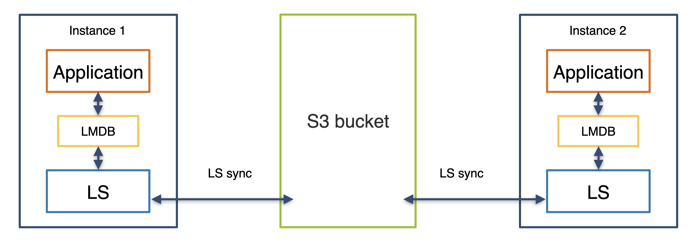

# LightningStream

LightningStream is a tool to sync changes between a local LMDB (Lightning Memory-Mapped Database) and 
an S3 bucket in near real-time. If the application schema is compatible, this can be used in a multi-writer
setup where any instance can update any data, with a global eventually consistent view of the data in seconds.

Our main target application is the sync of LMDB databases in the 
[PowerDNS Authoritative Nameserver](https://doc.powerdns.com/authoritative/) (PDNS Auth). We are excited
about how LightningStream simplifies running multiple distributed PowerDNS Authoritative servers, with full support
for keeping DNSSEC keys in sync.
Check the [Getting Started](getting-started.md) section to understand how you can use LightningStream together
with the PowerDNS Authoritative server.

Its use is not limited to the PowerDNS Authoritative server, however. LightningStream does not make any assumptions
about the contents of the LMDB, and can be used to sync LMDBs for other applications, as long as the data is stored
using a [compatible schema](schema.md).

## Basic Operation

LightningStream is deployed next to an application that uses an LMDB for its data storage:

Its operation boils down to the following:

- Whenever it detects that the LMDB has changed, it writes a snapshot of the data to an S3 bucket.
- Whenever it sees a new snapshot written by a _different instance_ in the S3 bucket, it downloads the snapshot
  and merges the data into the local LMDB. 

The merge of a key is performed based on a per-record last-modified timestamp:
the most recent version of the entry wins. Deletes entries are cleared and marked as deleted, together with
their deletion timestamp. This allows LightningStream to provide **Eventual Consistency** across all nodes.

If the application uses a [carefully designed data schema](schema.md), this approach can be used to support
multiple simultaneously active writers. In other instances, it can often be used to sync data from one writer to
multiple read-only receivers, or even with a single instance where a local persistent volume is not available.

## Open Source

This is the documentation for the Open Source edition of LightningStream.
For more information on how we provide support for Open Source products, please read
[our blog post on this topic](https://blog.powerdns.com/2016/01/18/open-source-support-out-in-the-open/).

PowerDNS also offers an Enterprise edition that includes professional support, advanced features, deployment
tooling for large deployments, Kubernetes integration, and more.

